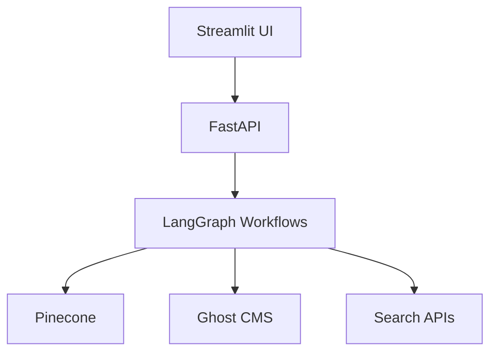

# Ghostwriter 🖋️

An AI-powered content generation platform built with:

- 🧠 LangGraph for orchestration
- 🚀 FastAPI backend
- 🎨 Streamlit frontend
- 🌲 Pinecone for uniqueness checking
- 👻 Ghost CMS publishing

## Features ✨

- 🧠 LangGraph-powered content generation workflows
- 🔍 Pinecone-based content uniqueness verification
- 📝 Automated Ghost CMS publishing
- 🔒 Google OAuth authentication
- 🐳 Docker container support
- 📊 Streamlit-based web app for invoking LangGraph

## Architecture Overview 🏗️



## Prerequisites 📋

- Docker and Docker Compose
- Python 3.11+
- Pinecone API key
- Ghost CMS credentials
- Google Cloud Platform account (for OAuth)

## Setup Guide 🛠️

## Workflow Overview 🔄

The application can be triggered in two ways:

1. **Web Search Mode**: Search the web using Serp, Google, or Tavily
2. **Direct URL Mode**: Provide a URL to directly generate an article

Key features:

- 🛎️ Slack notifications for article generation
- 👻 Articles published as drafts in Ghost CMS
- 🔗 URL filtering using Supabase
- 🔍 Multiple search engine options
- 🧠 AI-powered content generation

## Configuration ⚙️

### Environment Variables (.env)

```bash
# Required
PINECONE_API_KEY=your_pinecone_key
PINECONE_ENVIRONMENT=your_environment
PINECONE_INDEX=your_index_name
GHOST_API_URL=https://your-ghost-instance.com
GHOST_API_KEY=your_ghost_api_key

# Optional
SLACK_WEBHOOK_URL=your_slack_webhook
SUPABASE_URL=your_supabase_url
SUPABASE_KEY=your_supabase_key
TOKEN_KEY=$(python -c 'import secrets; print(secrets.token_urlsafe(32))')
ALLOWED_USERS=your_email@example.com
```

### Runtime Parameters (configuration.py)

| Parameter                        | Type      | Default                | Description                                                   |
| -------------------------------- | --------- | ---------------------- | ------------------------------------------------------------- |
| `system_prompt`                  | str       | System prompt          | Sets agent's behavior and context                             |
| `model`                          | str       | "deepseek/deepseek-v3" | Language model for content generation                         |
| `search_engines`                 | list[str] | ["tavily"]             | Search engines: "google", "tavily", "serp"                    |
| `max_search_results`             | int       | 2                      | Max results per search query                                  |
| `sites_list`                     | list[str] | None                   | Specific websites to search                                   |
| `search_days`                    | int       | 7                      | Days to look back for search results                          |
| `slack_enabled`                  | bool      | True                   | Enable Slack notifications                                    |
| `slack_format_code_blocks`       | bool      | True                   | Format Slack messages as code blocks                          |
| `use_query_generator`            | bool      | False                  | Generate search queries from user input                       |
| `use_url_filtering`              | bool      | False                  | Filter URLs already in Supabase                               |
| `use_search_enricher`            | bool      | False                  | Find additional relevant content                              |
| `similarity_threshold`           | float     | 0.80                   | Content uniqueness threshold (lower = stricter)               |
| `relevance_similarity_threshold` | float     | 0.90                   | Content relevance threshold (higher = stricter)               |
| `crawling_engines`               | list[str] | ["firecrawl"]          | Crawling engines to use. Currently only 'firecrawl' supported |

### Setup Steps

1. Clone the repository:
   ```bash
   git clone https://github.com/your-repo/ghostwriter.git
   cd ghostwriter
   ```

2. Create `.env` file:
   ```bash
   cp .env.example .env
   ```

3. Configure environment variables (see above table)

### 2. Google OAuth Setup 🔐

1. Go to [Google Cloud Console](https://console.cloud.google.com/)
2. Create a new project
3. Enable "Google Identity Platform" API
4. Configure OAuth consent screen:
   - Set User Type to "External"
   - Add your email as a test user
   - Add required scopes: email, profile, openid
5. Create OAuth 2.0 credentials:
   - Application type: Web application
   - Add authorized redirect URI: http://localhost:8501
6. Download credentials as `client_secret.json`
7. Place the file in the project root directory

### 3. Docker Compose Setup 🐳

1. Build and run services:
   ```bash
   docker-compose up --build
   ```

2. Access services:
   - Streamlit UI: http://localhost:8501
   - FastAPI Docs: http://localhost:8000/docs

## Core Components 🧩

### LangGraph Workflows

The system uses LangGraph to orchestrate complex content generation workflows:

- Article generation
- Content enrichment
- Uniqueness verification
- Publishing automation

### Pinecone Integration

Pinecone is used for:

- Content similarity checking
- Uniqueness verification
- Semantic search capabilities

### Ghost CMS Publishing

Automated publishing features:

- Content formatting
- SEO optimization
- Scheduled publishing
- Multi-format support (HTML, Markdown)

## Development 🛠️

### Running Locally

1. Install dependencies:
   ```bash
   pip install -r requirements-streamlit.txt
   pip install -r requirements-fastapi.txt
   ```

2. Start services:
   ```bash
   # FastAPI
   uvicorn src.fastapi_app:app --reload

   # Streamlit
   streamlit run src/streamlit_app.py
   ```

### Testing

Run tests with:

```bash
pytest tests/
```

## Contributing 🤝

We welcome contributions! Please see our
[Contribution Guidelines](CONTRIBUTING.md).

## License 📄

This project is licensed under the MIT License - see the [LICENSE](LICENSE) file
for details.

## Support ☕

If you find this project useful, consider supporting its development.
